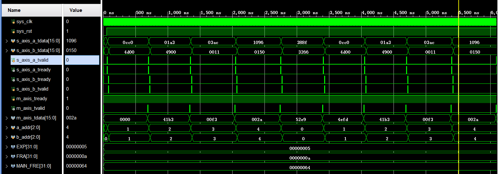

# 接口定义

1. 采用AXI-Stream握手协议。
2. aclk为时钟信号,aresetn为复位信号(低电平复位)。
3. 输入数据时,只有当valid与ready信号同时拉高时IP才会获取数据。
4. 输出数据时,valid信号拉高时代表新的一帧数据已准备好输出。
5. 输出数据时,ready信号拉高代表下一级模块已准备好接收上一级输出的数据。

                   _   _   _   _   _   _   _   _   _   _   _   _   _   _   _   _   _   _
        aclk     _| |_| |_| |_| |_| |_| |_| |_| |_| |_| |_| |_| |_| |_| |_| |_| |_| |_| |_
                       ___________________________________________________________________
        aresetn  _____|
                           _____________________________________________
        a_tvalid _________|                                             |_________________
                                   _                     _                     _
        a_tready _________________| |___________________| |___________________| |_________
                  __________________ _____________________ _____________________ _________
        a_tdata  |_______A1_________|________A2___________|_________A3__________|____A4___|
                            ____________________________________________
        b_tvalid __________|                                            |__________________
                                     _                     _                     _
        b_tready ___________________| |___________________| |___________________| |________
                  ____________________ _____________________ ______________________ _______
        b_tdata  |_________B1_________|________B2___________|_________B3___________|___B4__|
                                              _                                  _
        m_tvalid ____________________________| |________________________________| |_________
                  ___________________________ __________________________________ ___________
        m_tdata  |___________________________|_____________A1/B1________________|____A2/B2__|

# 浮点数

## 浮点数的组成

1. 根据IEEE-754标准,浮点数由三部分组成,分别是符号位(S),指数位(E)以及尾数位(M)。

            S          E                     M
         ______ _______________ ____________________________
        |______|_______________|____________________________|
 
- 16位浮点数(Half)  : S = 1 , E = 5  , M = 10
- 32位浮点数(float) : S = 1 , E = 8  , M = 23
- 64位浮点数(double): S = 1 , E = 11 , M = 52
- 注: 以上均表示位宽。

2. 与科学计数法相类似,值为:

$$ Value = sign * mantissa * exponent $$

### 指数与阶码
1. 阶码的固定值为:

$$ 2^{E-1} - 1 $$

2. 指数的表示范围:

$$ 2-2^{E-1} \sim 2^{E-1} - 1  $$

#### 阶码的作用

1. 指数的实际值是一个有符号数,如果用有符号数通常的表示方法――――补码,会使浮点数的比较变得困难。因此,会加上阶码将指数的值调整到无符号数的范围内以便进行比较。

2. 规格数与非规格数因为阶码的存在有了一个平滑的转变(在之后浮点数的分类会讲到)。

### 尾数隐藏位

1. 在具体的表示中,尾数是具有隐藏位的,隐藏位与可见位间有一个小数点,即尾数的可见位表示的是小数的部分。

            S          E                     M
         ______ _______________ 
        |______|_______________|____________________________
                            |__|____________________________|
                             /\
                            /  \
                         此处为隐藏位

2. 隐藏位在区分规格数与非规格数中发挥着重要的作用。

## 浮点数的分类

### 规格数

1. 尾数的隐藏位为1,指数部分的编码值范围为:

$$ 0 \sim 2^{E-1}-1 $$

2. 规格数的值为:
   

$$ Value = (-1)^S * \vert 1.M \vert * 2^E $$

注:此处E为指数的实际值,应该要减去阶码。

### 非规格数

1. 尾数的隐藏位为0,指数的编码值为0。
2. 非规格数的指数偏移值比规格数的指数偏移值小1。例如半精度下的6E-5,指数实际值为-14。
   

$$ Value = (-1)^S * \vert 0.M \vert * 2^E $$
   
#### 逐渐溢出

1. 以半精度为例,最小的规格数的指数为-14(1-15),其值为 

$$ 1 * 2^{-14} $$
   
2. 非规格数代表(0,1)之间的数。假设其为 

$$ (1 - \epsilon) * 2^{-14} $$

3. 当非规格数的尾数部分逐渐增大时,非规格数会逐渐向规格数逼近,最终成为最小的规格数。

$$ \vert 0.M \vert * 2^{-14} --> 1.0 * 2^{-14} $$

4. 因此可以知道为什么在尾数前会有一位隐藏位,以及为何要引入偏阶,这可以使非规格数与规格数之间进行平滑的转换。

$$
规格数指数计算: exponent - 2^{E-1} 
\\
非规格数指数计算: exponent + 1 - 2^{E-1}
$$

### 特殊数值

1. 无穷大:指数位全为1,尾数为全为0。

               |<-----------------E------------------->|<------------------M---------------------->|
               |                                       |                                           |       
        _______|_______ _______ _______ _______ _______|_______ _______ _______ _______ _______    |
       |       |       |       |       |       |       |       |       |       |       |       |   |
       |   S   |   1   |   1   |   1   |   1   |   1   |   0   |   0   |   0   |   0   |   0   |...|
       |_______|_______|_______|_______|_______|_______|_______|_______|_______|_______|_______|

2. NaN:指数位全为1,尾数非全0。

               |<-----------------E------------------->|<------------------M---------------------->|
               |                                       |                                           |       
        _______|_______ _______ _______ _______ _______|_______________________________________    |
       |       |       |       |       |       |       |                                       |   |
       |   S   |   1   |   1   |   1   |   1   |   1   |                != 0                   |...|
       |_______|_______|_______|_______|_______|_______|_______________________________________|

## 浮点数的除法

1. 状态图如下:
   

### 使用方式

1. s_axis_tready:拉高时代表IP可以接收数据,此时可将数据传递给IP;拉低时代表IP正在处理数据,未准备好接收数据。
2. s_axis_tvalid:拉高时代表传递的数据有效,拉低时则代表数据无效。只有当s_axis_tvalid与s_axis_tready都拉高时IP才会接收数据并对数据进行处理。
3. s_axis_tdata: 输入数据的通道。
4. m_axis_tdata: 输出数据的通道。
5. m_axis_tvalid:拉高时代表IP新的一帧数据已准备好输出,高电平持续一个周期后拉低,下一帧数据准备输出时会再拉高一个周期。
6. m_axis_tready:由下一级IP传递给此IP,拉高时代表下一级已准备好接收,拉低时代表下一级还未准备好接收。只有当m_axis_tvalid和m_axis_tready都拉高时才会将处理好的数据输出给下一级。

### 仿真结果

1. 输入端口的s_axis_tready信号拉高时代表IP准备好接收。
2. 仿真文件中在s_axis_tready拉高时将s_axis_tvalid拉高,完成数据的传输。
3. 仿真文件中将m_axis_tready一直拉高,预设下一级一直处于准备好接收的状态。
4. 当有新的一帧数据准备好输出时,m_axis_tvalid会拉高一个周期,随后拉低。当有新的一帧数据来临时,又会拉高一个周期。
5. 计算结果正确,可进行非规格数的运算,可通用配置。

### 算法流程

#### 获取数据

1. 根据AXI-Stream的握手协议进行数据的传输。

#### 分割提取

1. 将数据的符号位、指数位、尾数位分别截尾获取。

#### 特殊情况

1. 当输入的数据出现无穷大、NAN与非规格数时将会进行特殊处理。

#### 输入数据规格化

1. 当输入非规格数的时候需要对其进行规格化处理,以方便后续的尾数运算。

#### 符号位异或

1. 提取出输入数据的符号位后进行异或操作。

#### 阶码相减

1. 输入数据的阶码进行相减操作。

#### 尾数相除

1. 将余数与除数不断地比较大小并进行相减操作,从而实现除法运算。

2. 算法流程如下:

注:将余数和被除数视为一个,共享一个寄存器,余数的初值为被除数。

3. 电路图如下:

#### 结果规格化

1. 判断结果是规格数还是非规格数。
2. 对规格数进行规格化操作。
3. 非规格数进行指数累加、尾数右移,直至指数为0。

#### 舍入处理

1. 在进行尾数除法时,将商的末三位作为移出的部分保存起来,当末三位大于100时尾数加1。

#### 组装输出

1. 将符号位、指数位、尾数位进行拼接,并将结果进行输出。

## 浮点数乘法

### 使用方式

1. 同上。

### 仿真结果

1. 输入端口的s_axis_tready信号拉高时代表IP准备好接收。
2. 仿真文件中在s_axis_tready拉高时将s_axis_tvalid拉高,完成数据的传输。
3. 仿真文件中将m_axis_tready一直拉高,预设下一级一直处于准备好接收的状态。
4. 当有新的一帧数据准备好输出时,m_axis_tvalid会拉高一个周期,随后拉低。当有新的一帧数据来临时,又会拉高一个周期。
5. 计算结果正确,可进行非规格数的运算,可通用配置。

### 算法流程

#### 获取数据

1. 根据AXI-Stream的握手协议进行数据的传输。

#### 分割提取

1. 将数据的符号位、指数位、尾数位分别截尾获取。

#### 特殊情况

1. 当输入的数据出现无穷大、NAN与非规格数时将会进行特殊处理。

#### 输入数据规格化

1. 当输入非规格数的时候需要对其进行规格化处理,以方便后续的尾数运算。

#### 符号位异或

1. 提取出输入数据的符号位后进行异或操作。

#### 阶码相加

1. 输入数据的阶码进行相加操作。

#### 尾数相乘

1. 将两个数据的尾数进行相乘操作。

#### 结果规格化

1. 判断结果是规格数还是非规格数。
2. 对规格数进行规格化操作。
3. 非规格数进行指数累加、尾数右移,直至指数为0。

#### 舍入处理

1. 在进行尾数除法时,将商的末三位作为移出的部分保存起来,当末三位大于100时尾数加1。

#### 组装输出

1. 将符号位、指数位、尾数位进行拼接,并将结果进行输出。

